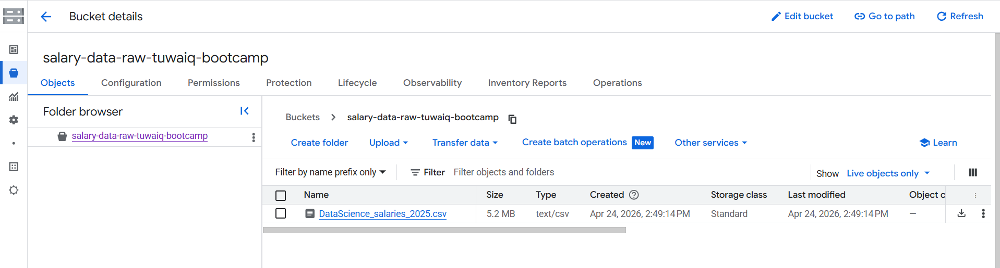
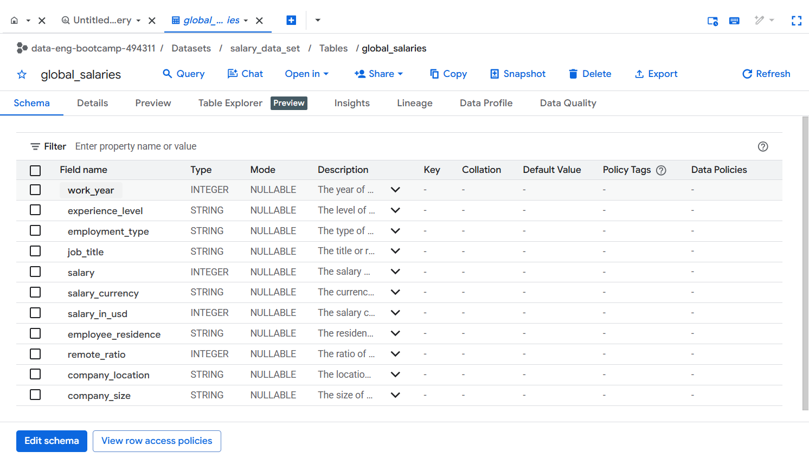
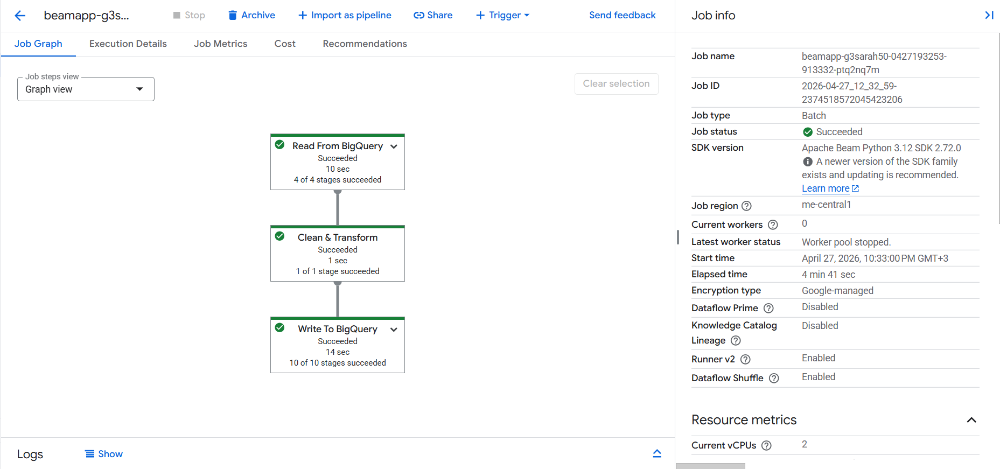

# 🌍 Global Data Salaries

---

## 📌 Project Use Case
In today's rapidly evolving tech landscape, many organizations face significant talent acquisition hurdles, often experiencing high candidate rejection rates due to salary offerings that do not align with current market benchmarks. Conversely, data professionals and job seekers struggle to accurately gauge their market value and understand what compensation they truly deserve. 

**The core objective of this project** is to bridge this gap. By developing an automated data engineering ecosystem and a predictive machine learning model, this project provides data-driven salary insights in **Saudi Riyals (SAR)** to help both employers and professionals make informed, market-aligned compensation decisions.

---

## 📌 Data Overview
The project utilizes a comprehensive global dataset containing over **93,000 records** and **11 key features** reflecting modern data science and engineering roles.

* **Data Source:** [Kaggle - Latest Data Science Job Salaries Dataset](https://www.kaggle.com/datasets/saurabhbadole/latest-data-science-job-salaries-2024)

### Dataset Features Schema:
| Feature Name | Description |
| :--- | :--- |
| `work_year` | The specific year the salary data was recorded. |
| `experience_level` | The employee's professional experience level (e.g., Entry-level, Mid-level, Senior, Executive). |
| `employment_type` | The type of employment contract (Full-time, Part-time, Contract, Freelance). |
| `job_title` | The specific role or title of the employee within the data ecosystem. |
| `salary` | The gross salary amount in its original currency. |
| `salary_currency` | The currency in which the salary was originally paid (e.g., USD, EUR, GBP). |
| `salary_in_usd` | The standardized salary amount converted into US Dollars for global comparison. |
| `employee_residence` | The primary country of residence of the employee. |
| `remote_ratio` | The proportion of remote work allowed for the position (0%, 50%, or 100%). |
| `company_location` | The country where the employing company's office is located. |
| `company_size` | The organizational size based on employee count (Small, Medium, Large). |

---

## 🏗️ Technical Architecture & Outlines

### 1. Data Ingestion (Google Cloud Storage)
- **Data Landing Zone:** The raw global dataset (`DataScience_salaries_2025.csv`) was securely uploaded and stored in **Google Cloud Storage (GCS)** buckets (`salary-data-raw-tuwaiq-bootcamp`), serving as the initial immutable landing layer.

### 2. Data Exploration & Staging (Google BigQuery)
Before setting up automated orchestration, the raw data was loaded directly into **Google BigQuery** (`salary_data_set.global_salaries`) to establish a staging environment.

- **Data Profiling & Inspection:** BigQuery was utilized to visually inspect value distributions, assess structural variations, and theoretically analyze what specific data cleaning and mapping logic the dataset required (without generating visual dashboard charts at this stage).
- **The Core Strategy (Automation vs. Manual Tasks):** While BigQuery possesses massive processing power to perform manual SQL alterations, the main goal of this project was to achieve **complete, production-ready pipeline automation**. Therefore, the data transformation rules were decoupled from manual queries and written entirely into an automated execution block.

### 3. Automated ETL Pipeline (Google Cloud Dataflow)
To achieve complete pipeline automation, a production-grade ETL ecosystem was engineered using the **Apache Beam ** and executed via **Google Cloud Dataflow** (`DataflowRunner`) 

The complete codebase for this pipeline can be reviewed here:
👉 [View Apache Beam ETL Pipeline Script](pipeline_process.py)

### 🔄 Execution Flow & Transformations (`SalaryDataTransform`)
Once triggered, the pipeline processes the data step-by-step through an isolated and fault-tolerant execution graph:

#### Step A: Data Ingestion (`Read From BigQuery`)
* Programmatically streams raw operational records directly from the initial Google BigQuery staging table.

#### Step B: Core Processing Logic (`beam.ParDo()`)
Before applying any transformations, the pipeline creates an isolated copy of each streaming record (`element.copy()`) to maintain thread safety and prevent raw data corruption. It then sequentially executes the following business logic:

1. **Currency Conversion & Column Cleanup:** Converts international standardized figures from USD into **Saudi Riyals (SAR)** (`salary_in_usd * 3.75`) to drive localization for the Saudi market context. It then dynamically drops legacy, unneeded source columns (`salary`, `salary_currency`) using Python's `pop()` method to minimize storage overhead.
2. **Company Size Mapping:** Maps complex shorthand alpha-codes into descriptive, user-friendly professional labels (Translates `S`, `M`, `L` into `Small`, `Medium`, `Large`).
3. **Experience Level Mapping:** Standardizes operational status attributes (`EN`, `MI`, `SE`, `EX` into `Entry-level`, `Mid-level`, `Senior-level`, `Executive-level`).
4. **Employment Type Mapping:** Converts contractual shorthand variations (`FT`, `PT`, `CT`, `FL`) into explicit designations (`Full-time`, `Part-time`, `Contract`, `Freelance`).
5. **Remote Work Ratio Mapping:** Evaluates numeric workspace ratios (`remote_ratio`) to dynamically categorize employees into structural work environments (`On-site` for 0, `Hybrid` for 50, and `Remote` for 100).
6. **Advanced Text Classification (Regex Matching):** Implements Regular Expressions (`re.search`) to intelligently scan raw, complex job titles and group them cleanly into 7 core technological domains (e.g., *AI & Machine Learning*, *Data Science*, *Data Engineering*, *Data Analysis & BI*, *Data Management & Governance*, *Software & Cloud Engineering*, and *Product & Business*).
7. **Geographic Regional Mapping:** Groups disparate international country codes (`company_location`) into consolidated global economic regions, explicitly creating a dedicated grouping for the **Middle East & Africa** region (which includes `SA` for Saudi Arabia).

#### Step C: Fault-Tolerant Exception Handling
* The entire analytical block is wrapped inside a robust `try-except` structure. If a corrupted row or data anomaly is encountered, it captures and logs the error specific to that row (`Error processing row: {e}`) while keeping the entire enterprise pipeline running smoothly without crashes.

#### Step D: Warehouse Loading (`Write To BigQuery`)
* Leverages BigQuery's auto-detect schema functionality (`SCHEMA_AUTODETECT`) to automatically infer table schemas, overwriting and loading the clean, completely transformed rows into the target layer (`global_salaries_cleaned`) using `WRITE_TRUNCATE`.

#### 🛠️ Dataflow Execution Graph:

#### 🛠️ Dataflow Execution Graph:

